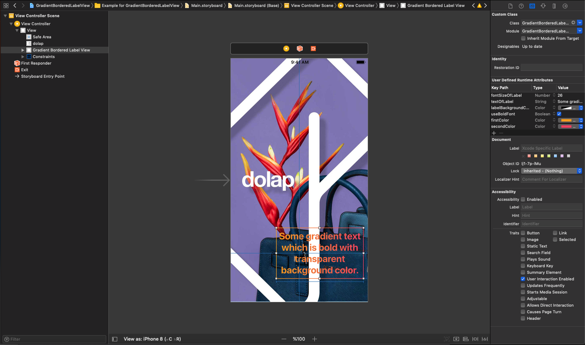
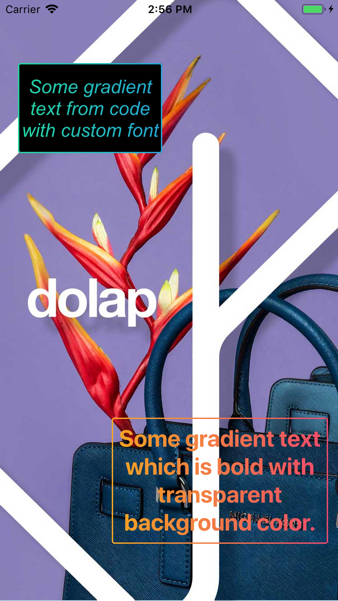

# GradientBorderedLabelView

[](https://travis-ci.org/mkeremkeskin/GradientBorderedLabelView)
[](https://cocoapods.org/pods/GradientBorderedLabelView)
[](https://cocoapods.org/pods/GradientBorderedLabelView)
[](https://cocoapods.org/pods/GradientBorderedLabelView)

## What does GradientBorderedLabelView do?
- You can add it from code or from storyboard
- You can see changes on the fly from storyboard because it's IBDesignable
- What If you are using autolayout or dynamic size? GradientBorderedLabelView will arrange font size according to label's size. No need to worry.

## Example

To run the example project, clone the repo, and run `pod install` from the Example directory first.

## Installation

GradientBorderedLabelView is available through [CocoaPods](https://cocoapods.org). To install
it, simply add the following line to your Podfile:

```ruby
pod 'GradientBorderedLabelView'
```
Or you can download the sample project, just drag and drop the GradientBorderedLabelView.swift file to your project.

## Usage

- You can add it from storyboard, change custom attributes on storyboard and see changes on the fly.

Or you can add it via code as below:
```swift
    let gradientLabel = GradientBorderedLabelView(frame: CGRect(x: 20, y: 70, width: 160, height: 100))
    gradientLabel.textOfLabel = "Some gradient text from code with custom font"
    gradientLabel.fontSizeOfLabel = 22
    gradientLabel.customFontName = "Arial-ItalicMT"
    gradientLabel.labelBackgroundColor = UIColor.black
```    

## Screenshots



## Author

mkeremkeskin@gmail.com / ([@mkeremkeskin](https://twitter.com/mkeremkeskin) on Twitter). 

## License

GradientBorderedLabelView is available under the MIT license. See the LICENSE file for more info.
